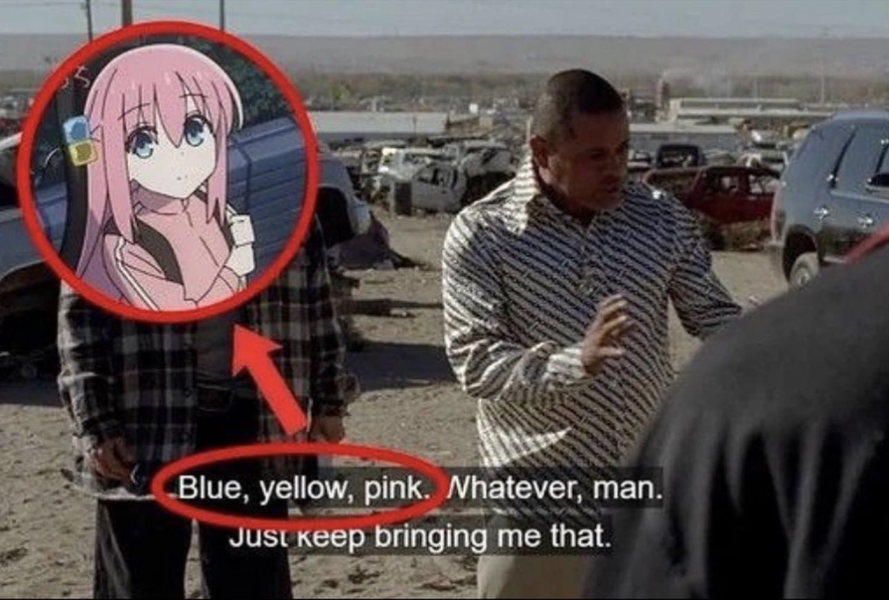

# Presentación Santiago Manuel Martín

Me llamo Santiago. La carrera que estoy cursando es Programación de Videojuegos, en modalidad virtual desde Rosario. En el 2022 curse un año de Desarrollo de Videojuegos en la UAI, pero termine abandonando porque me pareció pésima la cálidad de la educación en esa universidad.

Aún así, me gusto mucho aprender a desarrollar videojuegos, así que me alegro mucho de tener la posibilidad de estudiar esta carrera. Hasta ahora me va pareciendo muchísimo superior a la que curse anteriormente, y encima es pública! :star_struck::star_struck::star_struck:

No tengo fotos mías, así que dejo una del animal al que más me parezco: la cabra damasco :smiling_face_with_three_hearts:

### Mis cosas favoritas:
* Juegos: OneShot, Dark Souls II, The Stanley Parable
* Libros: Siddharta, Norwegian Wood
* Series: Better Call Saul, It's Always Sunny in Philadelphia, Okupas
* Peliculas: Perfect Days, A Silent Voice, Kill Bill
* Animes: K-On, Little Witch Academia, Gurren Lagann
* Mangas: Girls' Last Tour, Dead Dead Demon's DeDeDeDe Destruction, Atelier of Witch Hat
* VNs: Fate/Stay Night, Katawa Shoujo, Doki Doki Literature Club

